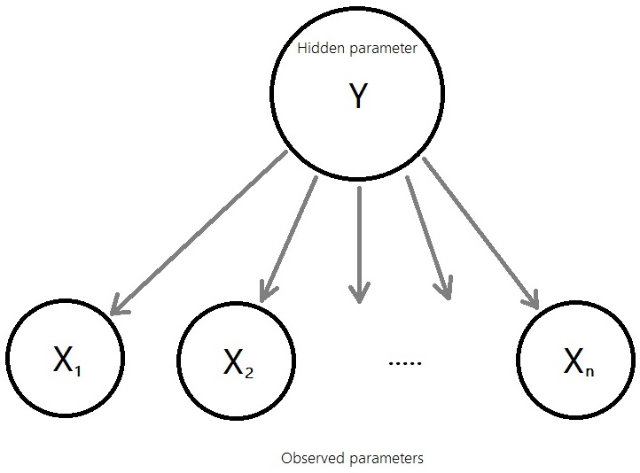
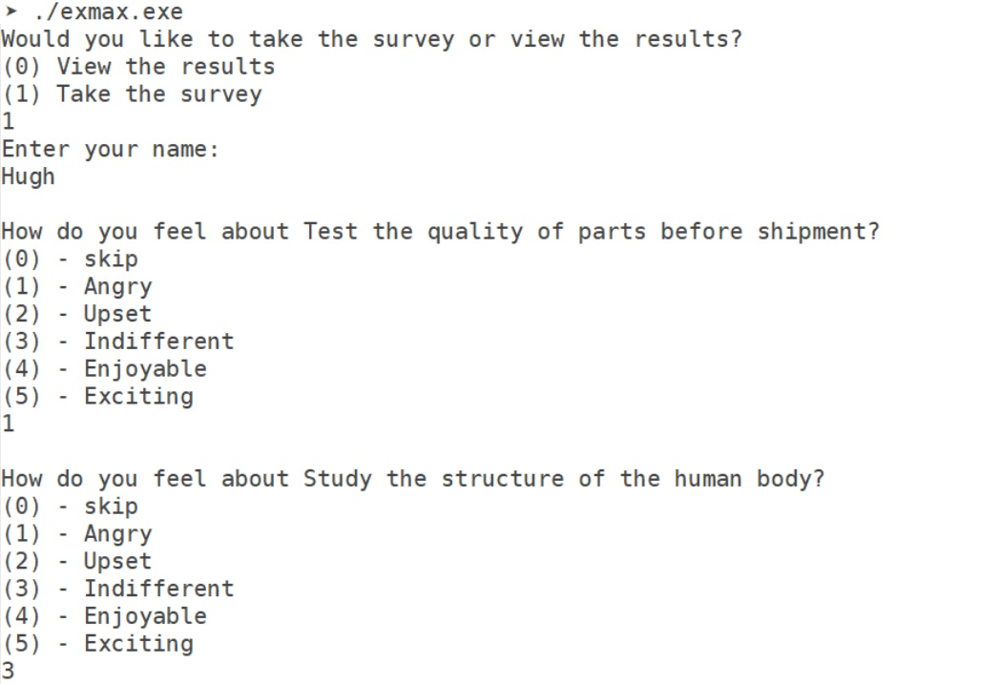
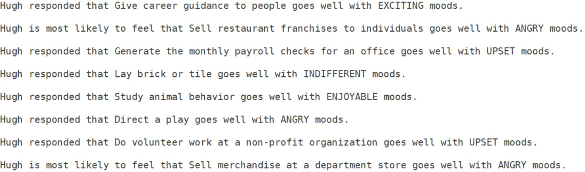

# Expectation-Maximization Calculator

An API that provides the ExpMax interface, which performs
expectation-maximization on a data set given by the user.
The data must be in accordance with the probability model
shown below. 
 
Suppose you have a certain selection of books and you have
a large number of people take a survey on whether they like
these books. Not every person will have read all the books in
your selection. The program will take the data from the survey
and calculate whether a person who hasn't read a certain book
would be likely to enjoy it. 
The context isn't limited to books nor binary response models.
The API can be applied to the question of people's favorite
dessert flavors or apparel colors. 
The number of possible responses can be any value (> 0), but
**all questions must have the same pool of possible responses**.
For example, questions 1 and 2 may ask for the person's favorite
ice cream and lollipop flavors, respectively, but question 3
cannot ask for the person's favorite salad dressing (unless
chocolate salad dressing is a thing). 
 
Also included is a command line utility that takes in data about
different people and their emotional responses to different
activities. It prompts the user to take a survey; each question
names an activity and asks the user to select the closest emotion
he/she would feel when performing the specified activity. At the
end of the survey, it calculates, for each activity the user did
not respond to, the emotion he/she would most likely experience
should he/she try that activity. 
This program uses the ExpMax API described above. 
 
The API uses expectation-maximization to calculate unobserved
data values. Feed the program data and it will learn on its
own about the subjects involved.

## Goal

**API**: 
The ExpMax interface enables expectation-maximization calculations.
Look at the probability model: 
 
Any data set that aligns with this model can be fed into an ExpMax
object to predict the missing values for the observed parameters.
Look below for formatting. 
 
**Survey program** (main.cpp): 
The program will take data and, given that person X has not given a
definite response to a specific activity (i.e. responded "don't know"
to "Conduct a musical choir"), determine the most likely response
person X would make to that same activity (i.e. person X is most
likely to feel upset when conducting a musical choir). To make this
calculation, the program learns from the inputs made by all others on
this activity as well as the inputs made by person X on all other
categories.

## Get started

Download all files. main.cpp and directories _personalityinput_ and
_deprecated_, as well as their contents, are not necessary. Any .jpg
files are not necessary. All other files are necessary. Keep all
files in the same directory. 
**ExpMax.h** is the sole interface necessary to utilize this API.
All other files contain subroutines that should **not** be
directly utilized. ExpMax.h alone contains sufficient interface to
provide any functionality that this program is capable of. 
main.cpp is the file that is compiled to create the executable for
the activities survey program. If only the API is desired, this is
not necessary. Feel free to refer to it when building your own
program that uses the ExpMax interface. 
Directory personalityinputs contains the input files that go with
the provided main.cpp file. Feel free to refer to its contents for
formatting. 
Use the provided makefile and run "make" on the command line in
the directory with all the files to compile into executable
"exmax.exe". 
Output of exmax.exe after compiling with given main.cpp: 
Survey: 

Results: 

## Input files

There are 4 different files to feed into the ExpMax
constructor: 
* Initial prior probability values
* Initial conditional probability values
* Data samples
* Titles/meanings

### Initial prior probability values

These values hold P(Y = *i*). Y is the unobserved hidden parameter,
the sole parent of all X parameters. There can be as many possible
*i* values as desired. 
These values don't necessarily have to be true; they serve as
starting points that the EM algorithm will start from. 
If a number of possible Y values is explicitly specified into the
ExpMax constructor, this file isn't necessary. 
**Format**: 
Place each value on a new line, going down from *i* = 1
to whatever number of options the user desires.

### Initial conditional probability values

These values hold P(Xc = *j* \| Y = *i*). Xc
is the observed parameter, and *j* is the response to that parameter
that a person may make. 
For example, one such value may represent the probability that a
person gives response #2 (*j* = 2) to category #3 (*c* = 3) given
that his/her hidden parameter is #4 (*i* = 4). 
Make sure that the range of Y values is consistent with what is
provided in the prior probability file. 
These values don't necessarily have to be true; they serve as
starting points that the EM algorithm will start from. 
If a number of possible Y values is explicitly specified into the
ExpMax constructor, this file isn't necessary. 
**Format**: 
Place each probability P(Xc = *j* \| Y = *i*)
on the line represented by *i* and *c*. The first line represents
*i* = 0, *c* = 0. The probability values are placed on that line, in
order of increasing j. The top left probability should be
P(X0 = 0 \| Y = 0). 
The second line represents *i* = 0, *c* = 1. This pattern repeats
until the maximum *c*-value is reached, upon which *c* resets to 0
and *i* increases by 1. This repeats until all *i*-values are
exhausted. 
There should be a total of *k* x *n* lines, where *k* is the total
number of possible Y-values and *n* is the total number of categories.
There should be a total of *k* x *n* x *m* probability values,
where *m* is the total number of possible X-values.

### Data samples

The data contains input from many people on different topics. 
For example, 200 people can respond to whether they like, dislike,
don't care for, or don't know 50 celebrities. As a result, there
would be 200 x 50 inputs. 
**Format**: 
Place each sample/person's inputs on a single line. Each
line represents a single sample/person. The inputs go from left to
right, going from *c* = 1 to however many categories are
specified by the user. Separate each input with a space. A input
of 0 signifies no input (i.e. "I don't know", "I haven't seen it").
The meanings of all other values can be assigned by the user; make
sure that only integers are used and that no value is skipped.
Again, **0** is reserved for signifying no input.

### Titles/meanings

This file doesn't affect or contribute to the EM calculations but
provides meaning to the calculations made. It enables the program
to have meaningful user interaction. 
It holds 3 segments: 
* labels for all *n* categories
* meanings assigned to all m possible responses (0 reserved for
"no response")
* names of all samples/people in the data

**Format**: 
Place the items in the order given immediately above.
Every label/meaning/name goes on its own line. Separate the segments
with a single empty line. Don't insert any empty lines in between
items of the same segment. The items in a segment must be ordered
in the same order they are portrayed within the other files. 
The sample names are not case-sensitive. 
 
If you cannot create files for initial prior and conditional
probabilities, you can instead provide the number of possible Y
values when an ExpMax object is constructed. Use the second
constructor to achieve this. The constructor will evenly distribute
the prior and conditional probabilities over all possible Y and
Xc values. 
 
**It is critically important that _all_ input files are formatted
correctly.** Otherwise, behavior is undefined.